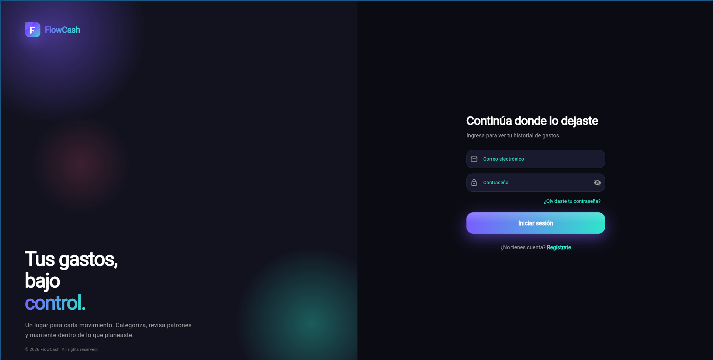
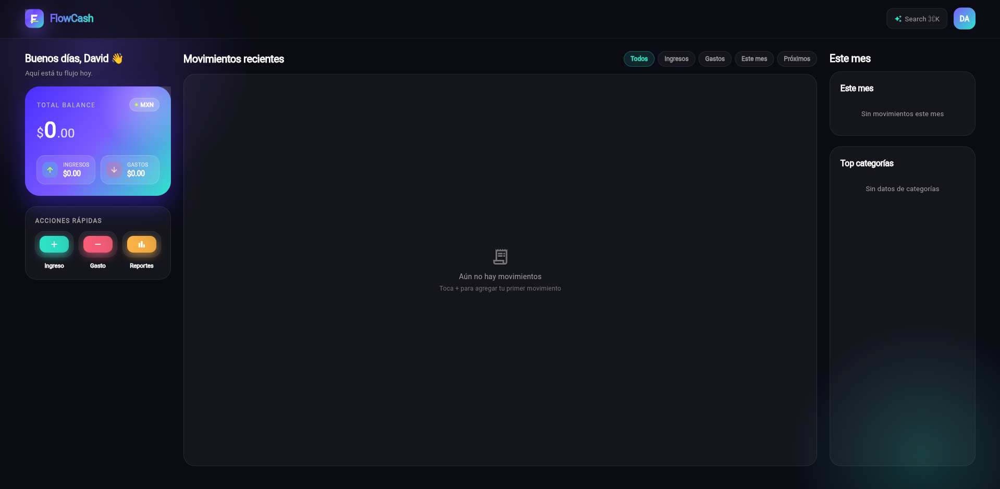
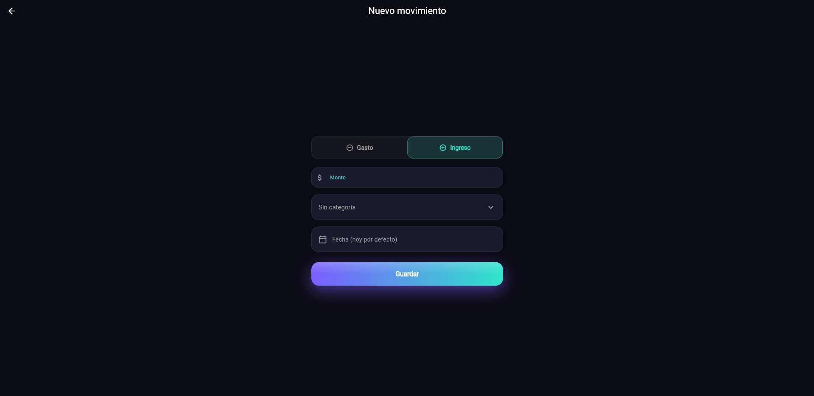

# FlowCash Frontend
Aplicación Flutter para control de finanzas personales (ingresos y gastos), conectada a una API REST con autenticación JWT.


## Resumen
FlowCash permite registrar movimientos, consultar balance y gestionar la sesión del usuario con renovación automática de tokens.

## Características
- Registro e inicio de sesión con `access_token` y `refresh_token`.
- Verificación de correo por código.
- Recuperación de contraseña por código.
- Dashboard con balance, ingresos, gastos y movimientos recientes.
- Filtros por tipo de movimiento, este mes y movimientos próximos.
- Alta y eliminación de movimientos.
- Carga de categorías por tipo de transacción.
- Interfaz responsive con layouts diferenciados para web y mobile.

## Capturas

- Login

- Dashboard

- Nuevo movimiento


## Stack tecnológico
- Flutter `>=3.22.0`
- Dart `>=3.4.0 <4.0.0`
- `flutter_riverpod` para manejo de estado
- `http` para consumo de API
- `flutter_secure_storage` para persistencia segura de tokens

## Inicio rápido

### 1) Requisitos previos
- [Flutter SDK](https://docs.flutter.dev/get-started/install)
- Backend disponible (por defecto `http://localhost:8000`)
- Chrome para web
- Emulador/dispositivo Android para pruebas mobile

### 2) Instalar dependencias
```bash
flutter pub get
```

### 3) Ejecutar en desarrollo
Web:
```bash
flutter run -d chrome --dart-define=API_BASE_URL=http://localhost:8000
```

Android:
```bash
flutter run -d android
```

Android con URL explícita de backend:
```bash
flutter run -d android --dart-define=API_BASE_URL=http://10.0.2.2:8000
```

Para listar dispositivos:
```bash
flutter devices
```

## Configuración de API
La app toma `API_BASE_URL` desde `--dart-define`.
Si no se define, aplica:
- Web: `http://localhost:8000`
- Android emulador: `http://10.0.2.2:8000`
- Otras plataformas: `http://localhost:8000`

## Calidad de código
```bash
flutter analyze
flutter test
```

## Estructura del proyecto
```text
lib/
  app.dart                 # Configuración de MaterialApp y enrutado por estado auth
  main.dart                # Entry point
  models/                  # Modelos de dominio (user, expense, category, tokens)
  providers/               # Estado global con Riverpod (auth, expenses, categories)
  screens/                 # Pantallas (auth, dashboard, formularios)
  services/                # API config, auth, almacenamiento y capa HTTP
  theme/                   # Tema y tokens de diseño
  widgets/                 # Componentes reutilizables
backend_docs/              # Documentación de endpoints del backend
```

## Flujo de autenticación
1. `SplashScreen` intenta restaurar sesión con `refresh_token`.
2. Si no hay sesión válida, el usuario va a login/registro.
3. El registro pasa a verificación por código de correo.
4. En sesión activa, se consumen movimientos y categorías.
5. Si el token expira, se ejecuta refresh automático.

## Roadmap
- [x] Autenticación y persistencia de sesión
- [x] Verificación de correo
- [x] Recuperación de contraseña
- [x] Dashboard con movimientos
- [x] Crear y eliminar movimientos
- [ ] Edición de movimientos
- [ ] Reportes y analítica avanzada
- [ ] Internacionalización y soporte multi-idioma
- [ ] Exportación de datos (CSV/PDF)

## Documentación del backend
- Revisa `backend_docs/README.md` para ver módulos y endpoints disponibles.

## Estado
MVP funcional en evolución activa.
